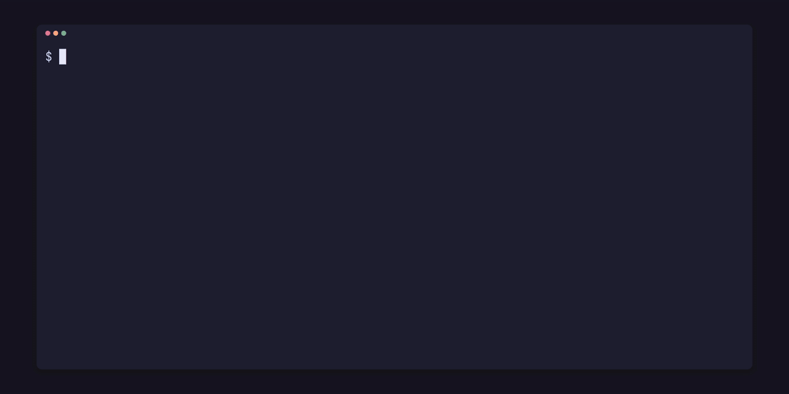

<p align="center"></p>

# pfx-scene

[](https://github.com/gmrdad82/pfx-scene/actions/workflows/ci.yml) [](https://github.com/gmrdad82/pfx-scene/tags)

One TOML format for 3D scenes, prefabs and material libraries, shared by a game engine and a 3D editor, so a scene saved in one opens in the other. It is the content format of pfx, the [PITO](https://pitomd.com) game and render engine, and of its editor; this crate reads, checks, resolves, edits and migrates it.

It is for the tools on either side of a scene file: an engine's loader, an editor that saves what a person arranges, a build tool that emits scenes, and a text editor that marks mistakes as someone types.

- **Readable files:** `*.scene.toml`, `*.prefab.toml`, `*.materials.toml` and `*.proxies.toml` under a `project.toml`, each starting with `format = 1`.
- **Typed tables** as plain serde data, with errors that point at file, line and column and carry a stable code.
- **Stable ids:** references go by id, with names as labels, so renames and moves never break them.
- **Prefabs** placed as objects, with per-placement overrides and namespaced ids.
- **Tunables:** a game's tuned values in `project.toml`, typed, with their defaults, ranges and inspector groups.
- **Play data:** character controllers, trigger volumes and rigid bodies on objects, camera rigs in scenes, and named collision layers in `project.toml`.
- **Animation and levels:** glTF clips with blends and sprite atlases with named clips and frame events on objects, and tile layers that place prefabs on a grid.
- **Versioned:** each file names its format version, and older files migrate, in memory or on disk.
- **A careful writer:** edits keep the author's comments, spacing, key order and number spelling, with undo and redo by exact text.
- **Standard assets,** referenced by path: glTF 2.0, PNG, WAV or Ogg Vorbis, TTF or OTF, Radiance HDR.

The format is specified in [docs/format.md](docs/format.md).

## Install

```toml
[dependencies]
pfx-scene = { git = "https://github.com/gmrdad82/pfx-scene", tag = "v0.1.0" }
```

It depends on `toml`, `toml_edit` and `serde` only, and forbids unsafe code. What changed in each version is in [CHANGELOG.md](CHANGELOG.md).

## Use

```rust,no_run
use std::path::Path;

use pfx_scene::{Project, SceneEdit, Target, check};

let project = Project::open(Path::new("my-game")).unwrap();
for diagnostic in project.check() {
    println!("{diagnostic}");
}

let scene = project.scene(Path::new("scenes/room.scene.toml")).unwrap();
for object in &scene.objects {
    println!("{} at {:?}", object.key, object.value.at);
}

let buffer = std::fs::read_to_string("my-game/scenes/room.scene.toml").unwrap();
let marks = check(&buffer, Path::new("scenes/room.scene.toml"), &project);
println!("{} marks for the editor", marks.len());

let mut edit = SceneEdit::open("my-game/scenes/room.scene.toml").unwrap();
edit.set(&Target::Object("crate".into()), &["at"], [0.0, 0.5, 1.0]).unwrap();
edit.undo().unwrap();

let migrated = project.migrate(Path::new("scenes/old.scene.toml")).unwrap();
std::fs::write("my-game/scenes/old.scene.toml", migrated).unwrap();
```

- `Project::check` checks every file of a project; `check` checks one unsaved buffer against it.
- `Project::scene` resolves a scene: includes merged, prefabs placed, references rewritten to the keys of the entries they name.
- `Project::read` returns one file as its typed data.
- `SceneEdit` edits a scene's files in place, refusing any edit that the checker would refuse; `dry_run` computes an edit's patches without writing.
- `Project::scene_with` and `check_with` resolve and check with unsaved texts in place of the files.
- `Project::fix` fills the ids a scene's files lack.
- `Project::migrate` rewrites an older file as format 1.

### Try it

[examples/demo](examples/demo) is a small project: a room with a floor, a lamp, a light and two crates placed from one prefab. The `scene-check` example checks a project, prints each finding with the line it points at, and sums up each scene once it resolves:

```sh
cargo run --example scene-check -- examples/demo
```

Break a file, a misspelt material or a path with the wrong case, and run it again to see the errors in the clip above.

## Build and test

A stable Rust toolchain (edition 2024) and [cargo-nextest](https://nexte.st) are all it needs.

```sh
bin/gate          # rustfmt, clippy with no warnings, every test and the doc tests
bin/gate --fast   # what CI runs on every push and pull request; the same checks while the crate is small
```

## Contributing

Issues and pull requests are welcome. Please read the [code of conduct](CODE_OF_CONDUCT.md) first, and report security problems as [SECURITY.md](SECURITY.md) says. A change to the format changes [docs/format.md](docs/format.md) with it, and `bin/gate` passes before a pull request.

## Licence

The code is MIT licensed: see [LICENSE](LICENSE). The MIT grant covers the code only: the PITO name and every app and game name and logo stay Catalin Ilinca's, all rights reserved, as [TRADEMARKS.md](TRADEMARKS.md) says. Where the format and the first code came from is in [NOTICE.md](NOTICE.md).
